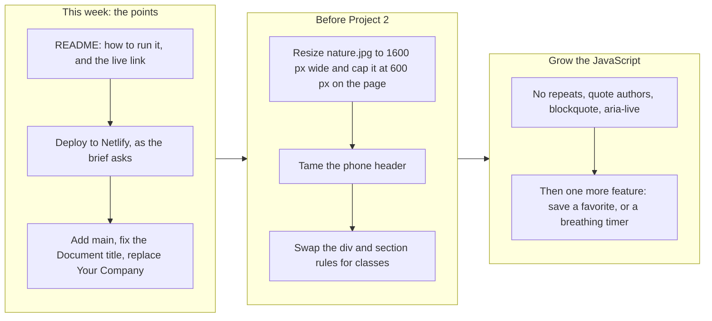

# Project 1: Static Foundations. Feedback for Muhammed Sanusi

**Student:** Muhammed Sanusi · **Course:** CSC 436, Fall 2026 · **Reviewed at commit:** [`1b15099`](https://github.com/muhammedsanusi890-oss/Modern-web-development-/commit/1b150994978d066723606ad574a2f95a4cca7413)
**Repo:** https://github.com/muhammedsanusi890-oss/Modern-web-development- · **Live:** https://muhammedsanusi890-oss.github.io/Modern-web-development-/quote.html

> **How this review was made.** Your instructor reviewed this project with Claude (Anthropic's AI) as a second set of eyes. Claude cloned the repo, read every line of both HTML files, both stylesheets and the script, ran the W3C validator on both pages, and loaded the live site in real phone and desktop viewports (375 by 667 and 1280 by 800, plus 320 and 768 for overflow). It measured the sticky header while scrolling, checked which of your five font families are actually used, clicked New Quote sixty times and counted repeats, compared the live site to the repo, and read all six commits. Every note and every point below was read and approved by your instructor. The late submission was approved ahead of time and costs nothing.

## Grade: 75 / 100

| Category | Points | Earned | One line |
|---|---|---|---|
| Semantic HTML | 20 | **17** | Both pages validate with zero messages; header, nav with a list, four sections, four articles, footer, one h1; no `main`, the tab title is "Document", quotes are bare paragraphs |
| CSS layout | 25 | **21** | Flexbox throughout and a real Grid with named areas, a calm and consistent palette; layout hangs off bare `div` and `section` selectors, no focus styles, hover effects on things that are not clickable |
| Responsive design | 15 | **12** | No horizontal scroll from 320 to 1280, grid collapses, nav stacks; the stacked header is sticky and takes a quarter of a phone screen, desktop-first, the About block never uses its width |
| JavaScript interaction | 15 | **11** | A working random-quote button that meets the requirement; five quotes, back-to-back repeats, nothing announced, a `console.log` left in |
| Repository and deployment | 15 | **7** | Started nine days early and the deploy matches the repo; hosted on GitHub Pages where the brief says Netlify, README has two of four items, the first commit is 70 percent of the site |
| Content and polish | 10 | **7** | A cohesive, genuinely calming page; a 1.57 MB 4K photo drawn larger than the hero, "© 2024 Your Company" in the footer, and not much content |
| **Total** | **100** | **75** | A pleasant, valid, working page. Most of what came off is paperwork and one afternoon of finishing. |

## The short version

The page does what it sets out to do: it feels calm. The mint gradient, the soft off-white, the rounded cards and the playful display font all belong together, and that kind of consistency is harder than it looks. Underneath, the HTML is clean. Both files validate with zero messages. You have a `header`, a `nav` holding a real list, four `section`s, an `article` for each tip, a `footer`, and exactly one `h1`. Flexbox does most of the layout and the tips use CSS Grid with named areas, which is a feature most of the class never touched: one wide card, two side by side, one wide card, collapsing to a single column on a phone. Nothing scrolls sideways at any width from 320 to 1280. The quote button works.

The biggest loss is in the repository category, and almost all of it is paperwork. The brief says "Deployed on Netlify" in three places and the site is on GitHub Pages. The README has a title and one sentence, with no instructions for running it and no live link. The first commit contains 327 of the project's 464 lines. None of that is about your code, and the first two are a fifteen-minute fix.

In the code itself there are three things to look at. Your stylesheet styles every `div` and every `section` on the page by tag name, which works today and will fight you the moment you add a div you did not want padded. On a phone the header stacks into a column and stays pinned, so a quarter of the screen is permanently the menu. And the JavaScript is the minimum that satisfies the brief: five quotes and one three-line handler.

## What the numbers looked like

| Check | Result |
|---|---|
| W3C HTML validator | 0 messages on `quote.html`, 0 on `index.html` |
| Horizontal scroll at 320 / 375 / 768 / 1280 px | None |
| Heading order | h1 > h2 > h3, no skipped levels, one h1 |
| Semantic elements | header, nav (ul of 4), 4 section, 4 article, footer; **no `main`** |
| Page `<title>` | "Document" on `quote.html` (the submitted link); "Mindful Moments" on `index.html` |
| Layout | Flexbox on header, nav, every section and every div; 1 Grid with `grid-template-areas` |
| Media queries | 2, both `max-width: 768px` (desktop-first) |
| Header on a 375 by 667 phone | 176 px tall, still pinned after scrolling 1,200 px: 26 percent of the screen |
| Section heights at 375 by 667 | 400 / 400 / 827 / 400 px |
| Fonts | 5 Google families requested; text uses 1 (DynaPuff). `body` asks for SN Pro, but the next rule overrides it for every text element |
| New Quote, 60 clicks | 5 distinct quotes; 7 times the same quote came up twice in a row |
| Console errors | 0 (one `console.log` per click is still in the script) |
| Image | nature.jpg is 3840 by 2160 and 1.57 MB; drawn at 1158 by 651 on a desktop, 253 by 142 on a phone |
| Page weight | 1,641 KB in total; the photo is 94 percent of it |
| Unused files | calm.jpg (214 KB) is committed and referenced nowhere |
| Commits | 6: four on Sep 6 and 7, two on Sep 17; the first is 327 of 464 lines |
| README | Title and one sentence; no run instructions, no live URL (2 of 4) |
| Hosting | GitHub Pages from `main`; the brief specifies Netlify |
| Live vs repo | Identical, all five files |

---

## Semantic HTML: 17 / 20

### What's working

- **Both pages validate with zero messages**, which most of the class did not manage. The structure is what the brief asks for: `header`, a `nav` with a `ul` of links ([quote.html#L17-L28](https://github.com/muhammedsanusi890-oss/Modern-web-development-/blob/1b150994978d066723606ad574a2f95a4cca7413/quote.html#L17-L28)), four `section`s each with an `h2`, an `article` with an `h3` for each tip ([#L54-L74](https://github.com/muhammedsanusi890-oss/Modern-web-development-/blob/1b150994978d066723606ad574a2f95a4cca7413/quote.html#L54-L74)), and a `footer`. One `h1`. `lang="en"` and a viewport tag. The image has real alt text. The script loads with `defer`.

### What to change

- **There is no `<main>`.** The sections sit directly in `body` between the header and the footer. Wrap them: `<main>` after `</header>` on [line 28](https://github.com/muhammedsanusi890-oss/Modern-web-development-/blob/1b150994978d066723606ad574a2f95a4cca7413/quote.html#L28) and `</main>` before `<footer>` on [line 86](https://github.com/muhammedsanusi890-oss/Modern-web-development-/blob/1b150994978d066723606ad574a2f95a4cca7413/quote.html#L86). It is the landmark a screen reader user jumps to, and the brief lists it by name.
- **The browser tab says "Document"** ([quote.html#L14](https://github.com/muhammedsanusi890-oss/Modern-web-development-/blob/1b150994978d066723606ad574a2f95a4cca7413/quote.html#L14)). That is the placeholder your editor wrote. You fixed it in `index.html` ("Mindful Moments"), but the link you submitted is `quote.html`, so that is the one people see in the tab, in bookmarks and in search results.
- **The quotes are not marked up as quotes** ([#L80](https://github.com/muhammedsanusi890-oss/Modern-web-development-/blob/1b150994978d066723606ad574a2f95a4cca7413/quote.html#L80)). A quote site should use `<blockquote>` with a `<cite>` for who said it. Your five have no attribution at all, and several are famous lines with known or disputed authors. Add the author to each entry and show it. Put `aria-live="polite"` on the container too, so a screen reader announces the new quote when the button is pressed; right now the text changes silently.
- Small: the `h1` sits inside the `nav` ([#L18-L19](https://github.com/muhammedsanusi890-oss/Modern-web-development-/blob/1b150994978d066723606ad574a2f95a4cca7413/quote.html#L18-L19)). The site name is not navigation. Make it a sibling of the `nav`, both inside `header`, and keep your flex rule on the header instead.

## CSS layout: 21 / 25

### What's working

- **A real Grid, used with intent.** `grid-template-areas` lays the four tips out as wide, two-up, wide ([quote.css#L72-L96](https://github.com/muhammedsanusi890-oss/Modern-web-development-/blob/1b150994978d066723606ad574a2f95a4cca7413/quote.css#L72-L96)), and the media query redraws the same areas as one column ([#L127-L135](https://github.com/muhammedsanusi890-oss/Modern-web-development-/blob/1b150994978d066723606ad574a2f95a4cca7413/quote.css#L127-L135)). Named areas are the most readable way to describe a layout in CSS, and you are one of very few students who used them. Flexbox handles the nav with `space-between` and `gap` ([general.css#L40-L52](https://github.com/muhammedsanusi890-oss/Modern-web-development-/blob/1b150994978d066723606ad574a2f95a4cca7413/general.css#L40-L52)) and centers the content of every section.
- The palette is small and disciplined: two greens for actions, a mint gradient, three off-whites. `box-sizing: border-box`, a reset, `img { max-width: 100% }`, soft shadows used consistently. It looks like one designer made it.

### What to change

- **Every `div` and every `section` on the page is styled by tag name** ([general.css#L82-L103](https://github.com/muhammedsanusi890-oss/Modern-web-development-/blob/1b150994978d066723606ad574a2f95a4cca7413/general.css#L82-L103)). `div { display: flex; flex-direction: column; padding: 20px; gap: 20px; }` applies to `.hero-container`, `.about-container`, `.about-text`, `.tips-grid`, `.quotes-container`, and to every div you ever add. It is why `.tips-grid` has 20 px of padding you never asked for, and inside the media query `div { text-align: center }` ([#L74-L76](https://github.com/muhammedsanusi890-oss/Modern-web-development-/blob/1b150994978d066723606ad574a2f95a4cca7413/general.css#L74-L76)) recenters all of them again. This works until the day you add a wrapper div for some other reason and it arrives pre-padded and flexed. Delete both tag rules, move those declarations to a class such as `.stack`, and put the class only where you mean it.

  ```mermaid
  flowchart LR
    R["general.css line 98: div gets display flex, column, 20 px padding, 20 px gap"]
    R --> a[".hero-container"]
    R --> b[".about-container"]
    R --> c[".about-text"]
    R --> d[".tips-grid: the class wins display, but still inherits the padding and gap"]
    R --> e[".quotes-container"]
    R --> f["and every div you add from now on, whether you want it or not"]
    f --> g["Fix: delete the div rule and the section rule. Put those styles on a class, such as .stack, and add the class where you mean it."]
  ```

- **The tip cards promise a click they cannot deliver** ([quote.css#L119-L125](https://github.com/muhammedsanusi890-oss/Modern-web-development-/blob/1b150994978d066723606ad574a2f95a4cca7413/quote.css#L119-L125)). On hover they lift, change color and show `cursor: pointer`, but they are not links or buttons. Either make them go somewhere or drop the pointer. Also, the `transition` is declared only inside `:hover`, so the card eases up and then snaps back; move the `transition` line to `.tip-card` and it eases both ways. The same hover block is pasted a second time inside the media query ([#L137-L143](https://github.com/muhammedsanusi890-oss/Modern-web-development-/blob/1b150994978d066723606ad574a2f95a4cca7413/quote.css#L137-L143)), where it changes nothing.
- **There are no focus styles.** Tab through the page: the links and the button get only the browser default. One rule covers it: `:focus-visible { outline: 3px solid #4A7C59; outline-offset: 3px; }`.
- **Five font families are requested and one is used** ([quote.html#L12](https://github.com/muhammedsanusi890-oss/Modern-web-development-/blob/1b150994978d066723606ad574a2f95a4cca7413/quote.html#L12)). `body` asks for SN Pro, but the very next rule sets DynaPuff on `h1, h2, h3, p, a, button`, which is every piece of text on the page ([general.css#L7-L19](https://github.com/muhammedsanusi890-oss/Modern-web-development-/blob/1b150994978d066723606ad574a2f95a4cca7413/general.css#L7-L19)). Caveat Brush, Henny Penny and UnifrakturMaguntia are never referenced. Trim the link to the families you use, and delete the duplicated `preconnect` pair on lines 10 and 11. A display font on body text is also tiring to read; consider keeping DynaPuff for headings and letting SN Pro do the paragraphs, which looks like what you first intended.

## Responsive design: 12 / 15

### What's working

- No horizontal scroll at 320, 375, 768 or 1280. The grid drops to one column, the nav stacks, the image scales with its container. Section heights on a real phone are sensible (400 px for the hero, about and quotes).

### What to change

- **On a phone the header takes a quarter of the screen and never leaves.** Below 768 px the nav becomes a column, so the header grows from 60 px to 176 px, and it is `position: sticky` ([general.css#L28-L38](https://github.com/muhammedsanusi890-oss/Modern-web-development-/blob/1b150994978d066723606ad574a2f95a4cca7413/general.css#L28-L38), [#L59-L72](https://github.com/muhammedsanusi890-oss/Modern-web-development-/blob/1b150994978d066723606ad574a2f95a4cca7413/general.css#L59-L72)). Claude scrolled 1,200 px down a 375 by 667 screen and the header was still pinned at the top: 176 of 667 pixels, 26 percent, on every screen of the page. Keep the four links in one wrapping row on phones (they fit), or make the header sticky only inside a `min-width` query.

  ```mermaid
  flowchart TB
    A["A phone screen is 667 px tall"] --> B["Under 768 px the nav stacks into a column, so the header grows from 60 px to 176 px"]
    B --> C["The header is position: sticky, so it never scrolls away"]
    C --> D["About a quarter of the screen is permanently the menu. Every section is read through the remaining 491 px."]
    D --> E["Fix A: keep the links in one wrapping row on phones. The header stays near 100 px."]
    D --> F["Fix B: make the header sticky only inside a min-width query, so it scrolls away on phones"]
  ```

- **Desktop-first.** Both queries are `max-width: 768px`. The brief asks for mobile-first: write the phone layout as your base rules and add columns inside `min-width` queries. With only two queries this is a ten-minute flip.
- **The About block is the same on every screen.** `.about-container` is a column at all widths ([quote.css#L51-L56](https://github.com/muhammedsanusi890-oss/Modern-web-development-/blob/1b150994978d066723606ad574a2f95a4cca7413/quote.css#L51-L56)), so on a desktop the photo is drawn 1158 px wide, taller than the hero, with one sentence underneath. At 768 px and up, make it a row: photo on the left capped at about 500 px, text on the right. That single change makes the desktop look designed.

## JavaScript interaction: 11 / 15

### What's working

- **It meets the brief and it is clean.** You select two elements, listen for a click, and change the page with `textContent` ([quote.js#L16-L19](https://github.com/muhammedsanusi890-oss/Modern-web-development-/blob/1b150994978d066723606ad574a2f95a4cca7413/quote.js#L16-L19)). `getRandomQuote` is a tidy one-liner ([#L4](https://github.com/muhammedsanusi890-oss/Modern-web-development-/blob/1b150994978d066723606ad574a2f95a4cca7413/quote.js#L4)), the starting message is set from the script, and there are zero console errors. Claude clicked sixty times and saw all five quotes.

### What to change

- **The same quote often comes up twice in a row.** With five quotes, one click in five picks the one already showing; in sixty clicks it happened seven times. To the visitor that looks like the button did nothing. This version never repeats back to back. Claude ran it 2,000 times before giving it to you: zero repeats, and all five quotes still come up.

  ```js
  let last = -1;

  function nextQuote() {
    let i;
    do {
      i = Math.floor(Math.random() * quotes.length);
    } while (i === last);
    last = i;
    return quotes[i];
  }
  ```

- **One small handler is the floor, not the target.** The brief asks for at least one interaction, and you have exactly one, three lines long. Give it somewhere to go: store each quote as `{ text, author }` and show both; add a "save this one" button that keeps favorites in `localStorage`; or build a one-minute breathing timer, which would suit this site perfectly.
- Small: `quote` and `quotebutton` never change, so they should be `const`, not `let` ([#L1-L2](https://github.com/muhammedsanusi890-oss/Modern-web-development-/blob/1b150994978d066723606ad574a2f95a4cca7413/quote.js#L1-L2)). Take out the `console.log` on [line 18](https://github.com/muhammedsanusi890-oss/Modern-web-development-/blob/1b150994978d066723606ad574a2f95a4cca7413/quote.js#L18).

## Repository and deployment: 7 / 15

### What's working

- You started on September 6, nine days before the deadline, which is the opposite of the last-minute dump the brief warns about. The live site is public and matches the repo file for file. Your later messages say what changed: "Added google fonts to texts for better styling," "Added grid styling to the tips section."

### What to change

- **The brief says Netlify, and this is on GitHub Pages.** The assignment lists "Deploy target: Netlify," says "Deployed on Netlify. The live URL must load your current work," and asks for "your live Netlify URL." Your site works and it is public, so this is a small deduction, not a large one. But connecting a repo to Netlify is a skill the rest of the semester builds on, and it takes five minutes: Add new site, Import an existing project, pick this repo, no build settings.
- **The README has two of the four required items** ([README.md](https://github.com/muhammedsanusi890-oss/Modern-web-development-/blob/1b150994978d066723606ad574a2f95a4cca7413/README.md)). Title and one sentence. Add how to run it ("Clone the repo and open `index.html` in a browser") and the live link. These are the cheapest three points on this page.
- **The first commit is most of the site.** 327 of the project's 464 lines arrived in "First commit for the static foundation project," and the next one is also called "first commit." The brief asks for a history that shows the project being built. Commit when the header works, again when the hero works, again when the grid works.
- **Housekeeping.** `quote.html` and `index.html` are the same page twice, and they have already drifted apart (one has the right title, one does not). Keep `index.html` and delete the other. `calm.jpg` is 214 KB and used nowhere. `.vscode/settings.json` is committed and there is no `.gitignore`; add one with `.vscode/` and `.DS_Store` in it.
- Small: your README is saved as UTF-16, which usually means it was created with `echo` in PowerShell. GitHub displays it fine, but many tools show it as garbage. Re-save it as UTF-8 from VS Code (click the encoding in the status bar).

## Content and polish: 7 / 10

### What's working

- The site has a mood and keeps it. The colors, the rounded shapes, the emoji on each tip, and the beach photo all say the same thing. The copy is short and readable, and the call-to-action button takes you straight to the tips.

### What to change

- **The photo is a 4K file.** `nature.jpg` is 3840 by 2160 and 1.57 MB ([quote.html#L42](https://github.com/muhammedsanusi890-oss/Modern-web-development-/blob/1b150994978d066723606ad574a2f95a4cca7413/quote.html#L42)), which is 94 percent of the 1641 KB the page downloads. On a phone it is drawn at 253 px wide. Resize it to 1600 px wide and export as JPEG at 80 percent or WebP, and it will be under 200 KB with no visible difference.
- **"© 2024 Your Company. All rights reserved."** ([#L87](https://github.com/muhammedsanusi890-oss/Modern-web-development-/blob/1b150994978d066723606ad574a2f95a4cca7413/quote.html#L87)). That is template text, and it is 2026. Put your name there. "About Us" and "We help you build small habits" read the same way; say who is behind the page and why, in a sentence or two of your own. The footer is also the one unstyled part of the page, sitting flush against the left edge.
- **There is not much here.** Four one-line tips, five quotes without authors, one photo. Eight to ten tips with two sentences each, and a dozen attributed quotes, would make it feel like a finished site.

---

## Your next moves



1. **Do the paperwork.** README, Netlify, `<main>`, the page title, your name in the footer, delete the duplicate page and the unused image. About half an hour, and it is most of the points that came off.
2. **Fix the phone header and the photo.** One wrapping row of links, and a 1600 px image laid out beside its text on wide screens.
3. **Give the JavaScript something to do.** No repeats, real attributions, and one more feature that fits the theme.

*This review lives in a pull request on your repo. It only adds files under `feedback/` and does not touch your code. Merge it, close it, or just read it. Questions go to office hours or the Brightspace board. The design sense is already there, Muhammed. The next step is finishing the edges.*
